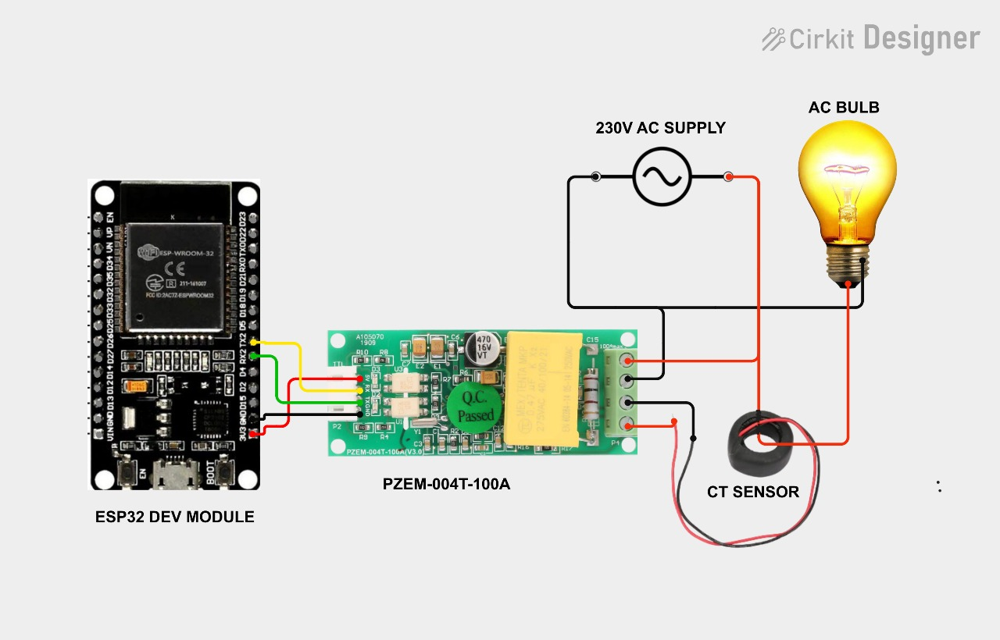
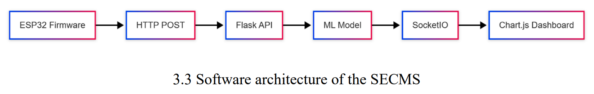
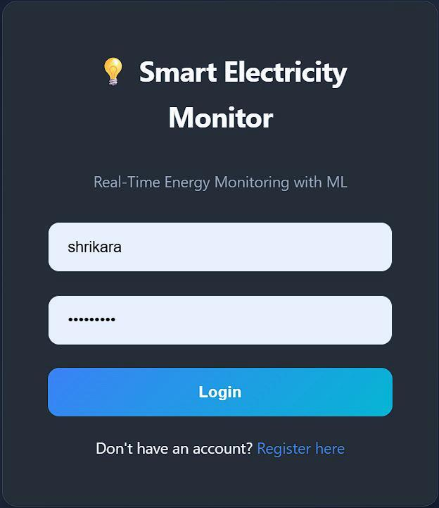
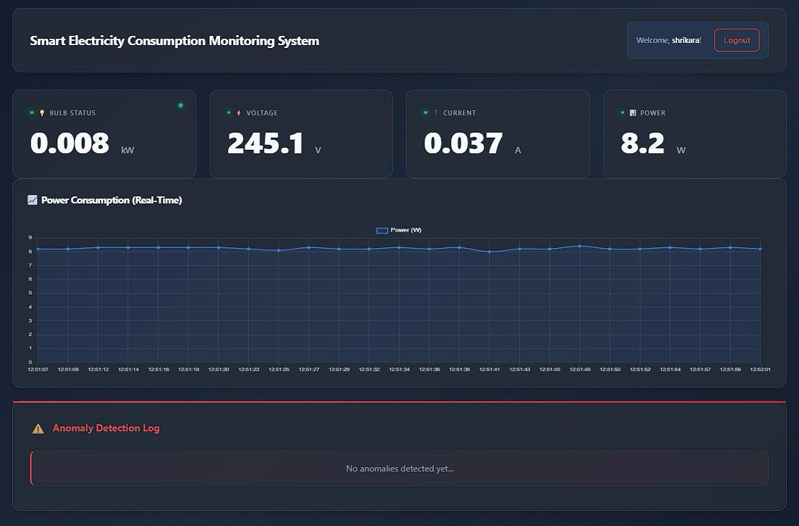
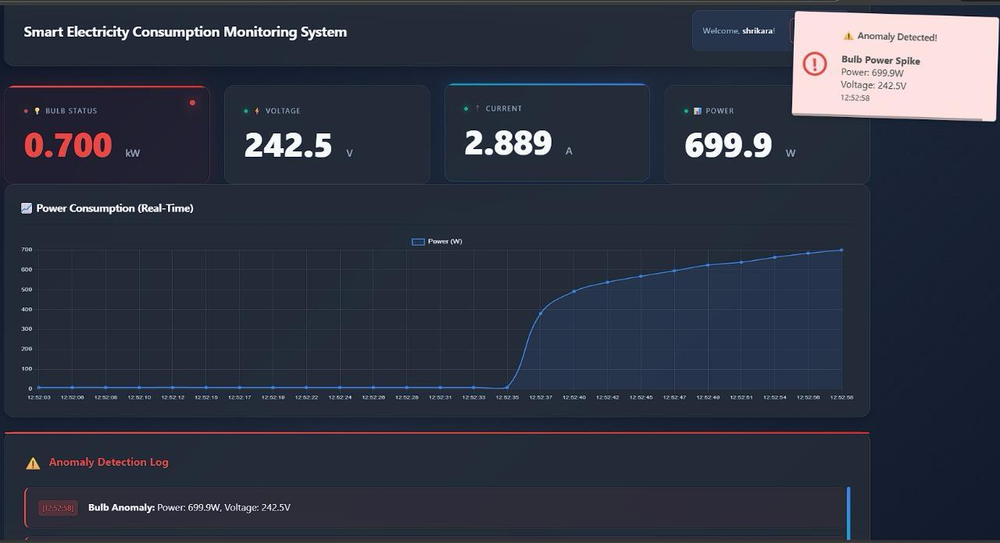

# Smart Electricity Consumption Monitoring System

## Overview

This project is an IoT-based Smart Electricity Consumption Monitoring System designed for homes, hostels, and small facilities to track and analyze power usage in real time.  
It uses an ESP32 microcontroller with a PZEM-004T energy meter to measure voltage, current, power, and energy consumption from the mains supply.  
The ESP32 sends the live readings to a Flask backend, which stores the data and exposes it to a web-based dashboard.  
Users can monitor real-time values, view historical trends, and better understand their electricity consumption through an interactive and user-friendly interface.  
The main goal is to promote energy awareness and help users make informed decisions to reduce wastage and manage their electricity bills more effectively.

## Features

- **Real-time Monitoring**: Live voltage, current, power, energy display
- **Anomaly Detection**: ML models detect unusual consumption patterns 
- **Interactive Dashboard**: Responsive web interface with login, graphs, and instant alerts
- **Historical Data**: Track consumption trends and analyze usage patterns over time
- **User Authentication**: Secure login system with JSON-based user management
- **High Accuracy**: Industrial-grade PZEM-004T sensor (±0.5% accuracy)

## Tech Stack

| Component    |               Technology                       |
|--------------|------------------------------------------------|
| Hardware     | ESP32 + PZEM-004T v3 energy meter              |
| Backend      | Flask (Python) web server                      |
| Frontend     | HTML/CSS/JavaScript with responsive design     |
| Data Storage | JSON file system (scalable to database)        |
| ML Model     | Isolation Forest                               |
| Communication| UART serial (ESP32 ↔ PZEM), HTTP/WebSocket     |

## Methodology Diagram

## Setup and Installation

### Hardware Setup
1. Connect PZEM-004T to ESP32 (5V, GND, TX→GPIO16, RX→GPIO17)
2. Wire CT sensor to mains supply through PZEM terminals
3. Flash `Smart_Monitor.ino` to ESP32 with your WiFi credentials

### Software Setup

# Clone repo
git clone https://github.com/Shrikara-2004/Smart-Electricity-Consumption-Monitoring-System.git
cd Smart-Electricity-Consumption-Monitoring-System

# Install Python dependencies
pip install flask pandas scikit-learn

# Update ESP32 IP in app.py
# Run Flask server
python app.py
Visit http://localhost:5000 in browser.

## How It Works

1.ESP32 reads AC parameters from PZEM-004T every 2 seconds via UART

2.Data sent to Flask server via HTTP POST requests

3.ML Models analyze patterns and flag anomalies (microwave spike detection)

4.Dashboard shows live values, graphs, and instant anomaly alerts

5.Historical data stored for trend analysis and usage reports

## Output actions
Login Page

Dashboard

Anomaly Alerts

## Future Improvements

->Database migration (SQLite/PostgreSQL)

->Mobile app with push notifications

->Multi-device support (multiple ESP32s)

->Cloud deployment (AWS IoT/Heroku)

